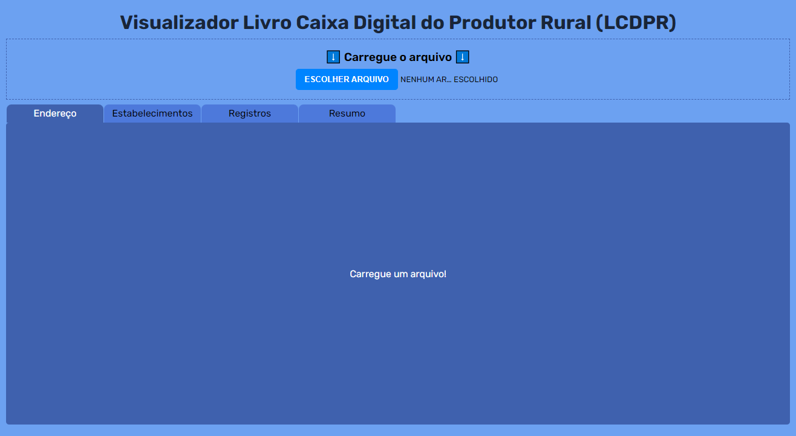

# Totalizador/Visualizador LCDPR
>Totalizador para ser usado com o arquivo do Livro Caixa do Produtor Rural

> Este projeto tem o objetivo de oferecer um Visualizador/Totalizador para o arquivo do Livro Caixa do Produtor Rural no Layout 1.3.

## 💻 Técnologias e ferramentas

As seguintes tecnologias/ferramentas foram utilizadas:

   

## ☕ Usando o Comparador de Preços

Acesse o projeto em execução no Github Pages, através do link: [Totalizador/Visualizador LCDPR](https://gabrielsouzas.github.io/totalizador-lcdpr/)

## 🤝 Colaboradores

Agradecemos às seguintes pessoas que contribuíram para este projeto:

<table>
  <tr>
    <td align="center">
      <a href="#">
         
        
          <b>Gabriel Souza</b>
        
      </a>
    </td>
  </tr>
</table>

[⬆ Voltar ao topo](#totalizador-lcdpr) 